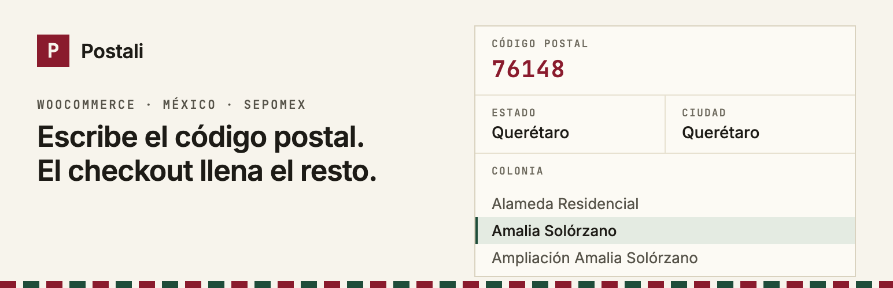
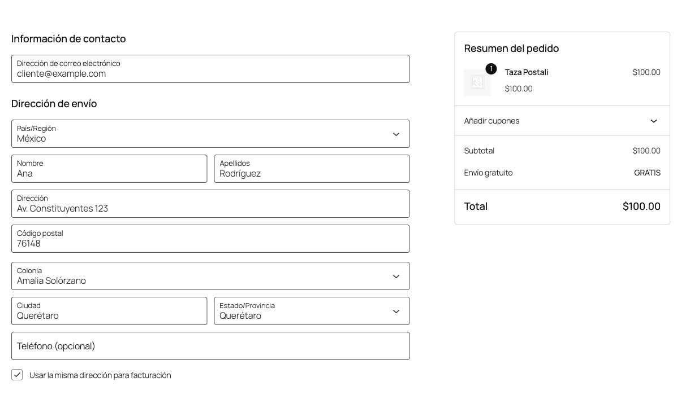

# Postali — Códigos postales de México (WooCommerce)

Plugin de WooCommerce que autocompleta la dirección en el checkout a partir del **código postal**: llena el estado y la ciudad, y convierte la colonia en una lista con todas las colonias de ese CP. Usa la [API pública de Postali](https://postali.app/api) con datos de SEPOMEX: sin API key, sin registro, sin cuota mensual.

**Instálalo desde WordPress.org:** https://wordpress.org/plugins/postali-codigos-postales/

- Funciona con el checkout clásico (`[woocommerce_checkout]`) y con el de bloques, en envío, facturación y Mi cuenta > Direcciones.
- Si el CP tiene una sola colonia, la elige sola. La opción "Otra (escribirla a mano)" cubre las colonias que SEPOMEX todavía no registra.
- La colonia se guarda en "Dirección línea 2" (la convención de las tiendas mexicanas) o en un campo propio.
- Validación opcional en el servidor al confirmar el pedido. Si la API no responde, el pedido pasa igual: una falla de red nunca bloquea el checkout.
- Compatible con HPOS.



## Estructura

| Ruta | Qué es |
|---|---|
| `postali-codigos-postales/` | El plugin tal como se distribuye (lo que va a SVN) |
| `translations/readme-es_MX.txt` | Traducción del readme para translate.wordpress.org |
| `tests/js/` | Pruebas del núcleo JS (`node --test`) |
| `tests/e2e/` | Blueprint de WordPress Playground con WooCommerce y datos de prueba |
| `svn/` | Checkout local del SVN de wordpress.org (ignorado por git) |

## Desarrollo

```bash
npm test                # pruebas con fixtures
npm run test:live       # mismas pruebas contra la API real
npm run playground      # WordPress + WooCommerce en http://127.0.0.1:9400 (Node ≥ 24)
npm run zip             # empaqueta postali-codigos-postales.zip
```

## Publicar una versión

```bash
# 1. Subir Version (postali-codigos-postales.php) y Stable tag (readme.txt), y añadir el changelog
# 2. Copiar el plugin al checkout SVN y crear el tag
svn co https://plugins.svn.wordpress.org/postali-codigos-postales svn   # sólo la primera vez
rsync -a --delete --exclude .DS_Store postali-codigos-postales/ svn/trunk/
cd svn && svn add --force trunk && svn cp trunk tags/X.Y.Z
svn ci -m "Postali X.Y.Z" --username gomflo
```

Banner, ícono y capturas viven en `svn/assets/` (no dentro del plugin).

## Licencia

GPLv2 o posterior.
